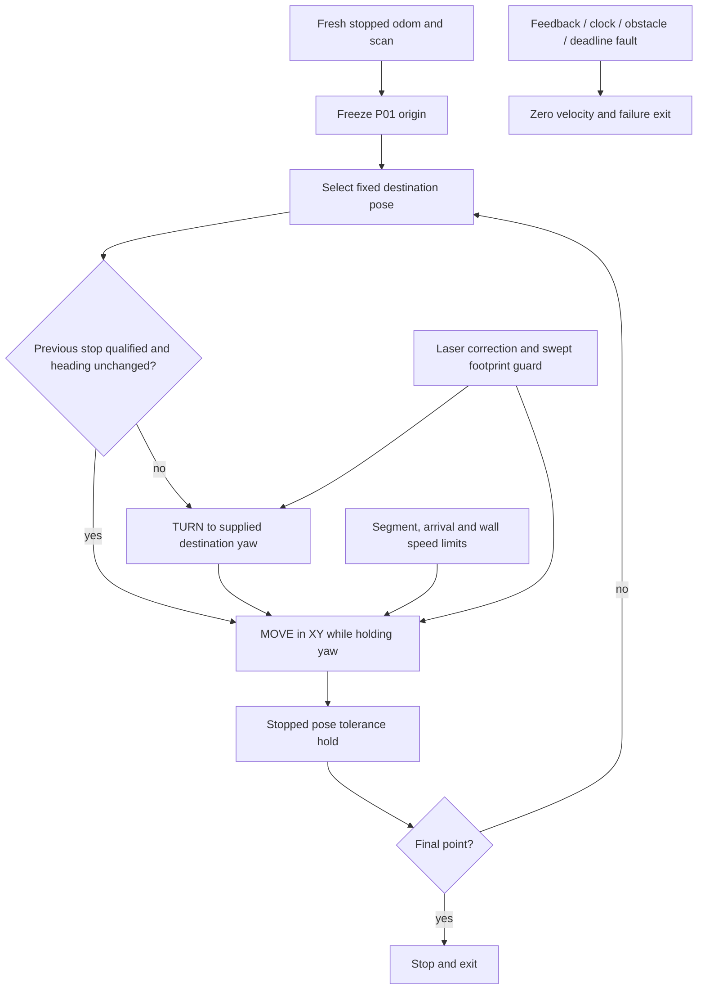
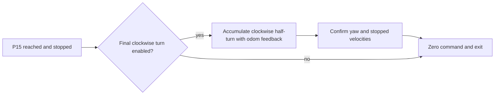

# Control flow

```mermaid
flowchart TD
  A[Fresh stopped odom and scan] --> B[Freeze P01 origin]
  B --> C[Select fixed destination pose]
  C --> Q{Previous stop qualified and heading unchanged?}
  Q -- no --> D[TURN to supplied destination yaw]
  Q -- yes --> E
  D --> E[MOVE in XY while holding yaw]
  E --> F[Stopped pose tolerance hold]
  F --> G{Final point?}
  G -- no --> C
  G -- yes --> H[Stop and exit]
  L[Segment, arrival and wall speed limits] --> E
  S[Laser correction and swept footprint guard] --> E
  S --> D
  X[Feedback / clock / obstacle / deadline fault] --> Y[Zero velocity and failure exit]
```

## Terminal action

```mermaid
flowchart LR
  A[P15 reached and stopped] --> B{Final clockwise turn enabled?}
  B -->|yes| C[Accumulate clockwise half-turn with odom feedback]
  C --> D[Confirm yaw and stopped velocities]
  D --> E[Zero command and exit]
  B -->|no| E
```

Partial last_point trials finish before this branch. Terminal obstacle protection
remains active, but clearance translation is disabled.
