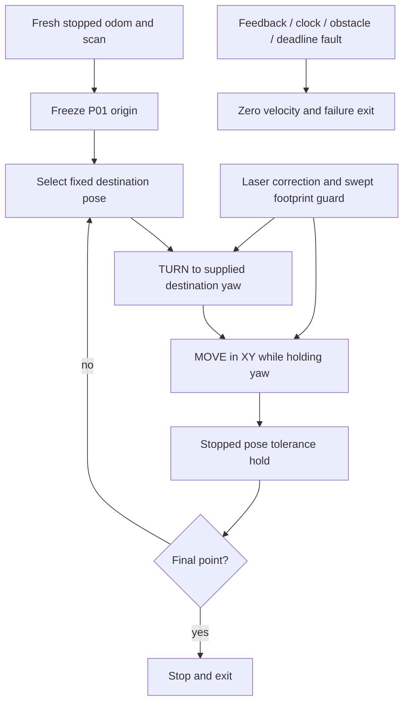

# Control flow

```mermaid
flowchart TD
  A[Fresh stopped odom and scan] --> B[Freeze P01 origin]
  B --> C[Select fixed destination pose]
  C --> D[TURN to supplied destination yaw]
  D --> E[MOVE in XY while holding yaw]
  E --> F[Stopped pose tolerance hold]
  F --> G{Final point?}
  G -- no --> C
  G -- yes --> H[Stop and exit]
  S[Laser correction and swept footprint guard] --> E
  S --> D
  X[Feedback / clock / obstacle / deadline fault] --> Y[Zero velocity and failure exit]
```
