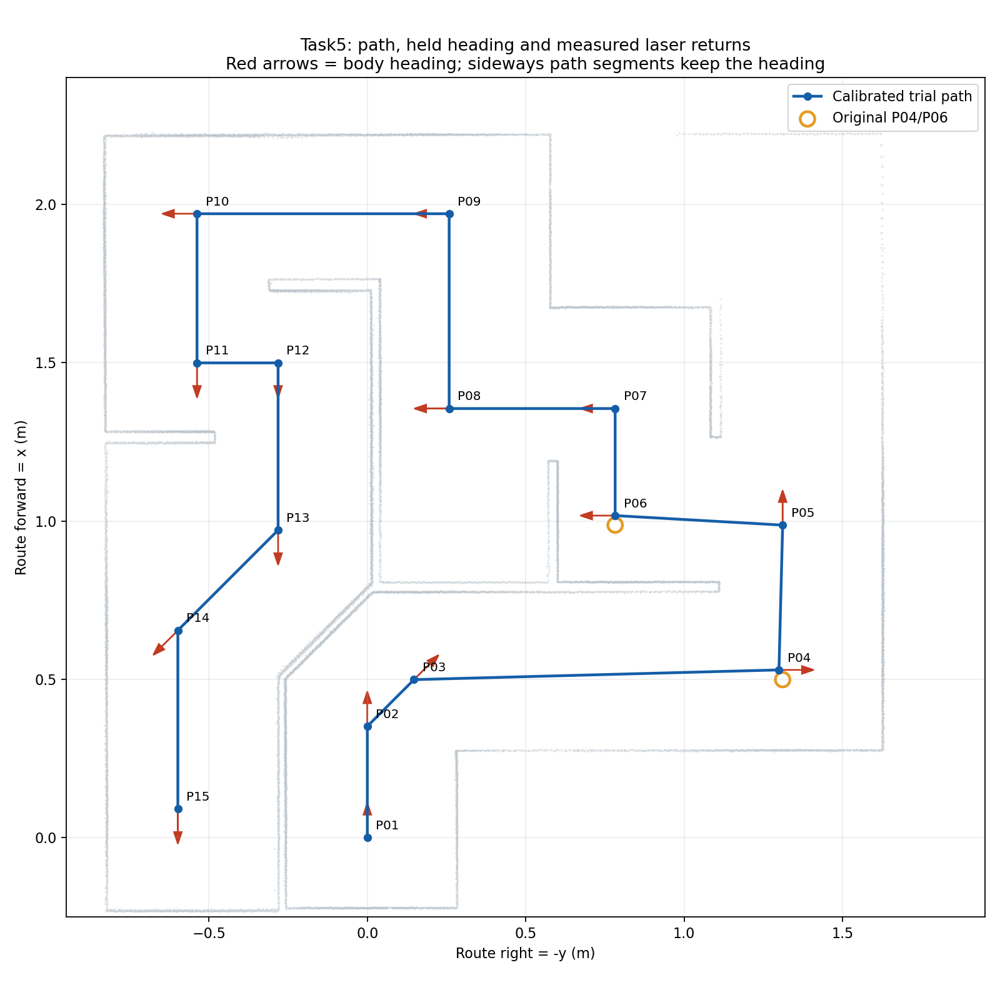

# Laser waypoint survey — 2026-10-09

The GIF was inspected as a 314-frame sequence. It supports forward/diagonal movement, in-place turns and heading-preserving strafes. The exact headings remain those provided by the user; pixels are not used to claim metric coordinates.

## Measured candidates

| Point | Original x,y (m) | Tested candidate x,y (m) | Heading | Reason |
|---|---|---|---|---|
| P04 | 0.499125, -1.311200 | 0.529834157482244, -1.2995249953232941 | -90 deg | Baseline full next-turn sweep estimated 0.002 m clearance; 0.03 m body-left shift estimated 0.031 m. |
| P06 | 0.987016, -0.782381 | 1.017016, -0.782381 | 90 deg | Baseline rerun stopped at side clearance near the 0.015 m guard; shift away from the left wall. |

P04 candidate combines the measured stopped pose with the laser-derived displacement; it is about +30.7 mm x / +11.7 mm y relative to the nominal point. P06 adds 30 mm route x. Other coordinates and all yaw values are unchanged. These are tested local reference coordinates, not uniquely correct or survey-grade positions. Small lateral components are expected on the approaches to adjusted points.

## Stopped-point measurements

Directions refer to the body at that stop. Distances are medians of axis-projected returns in +/-12 degree windows, transformed into base_link using TF, with known chassis self-returns excluded. They are not bumper clearance. A window may include an opening or multiple walls; an asterisk marks median absolute spread above 15 mm, unsuitable as a single-wall anchor without further fitting.

| Point | Measured route x,y (m) | Front (m) | Left (m) | Right (m) | Rear (m) |
|---|---|---:|---:|---:|---:|
| P01 | 0.0000, 0.0000 | 0.762* | 0.258 | 0.283 | 0.221 |
| P02 | 0.3400, 0.0001 | 0.419* | 0.258 | 1.627 | 0.561 |
| P03 | 0.4891, -0.1395 | 0.408* | 0.292 | 0.302* | 0.569* |
| P04 | 0.5295, -1.2874 | 0.338 | 1.693 | 0.252 | 1.524* |
| P05 | 0.9742, -1.3129 | 1.248 | 0.714 | 0.313 | 0.698 |
| P06 | 1.0178, -0.7960 | 0.196 | 0.210 | 0.658 | 0.831 |
| P07 | 1.3441, -0.7864 | 0.748 | 0.536 | 0.331 | 0.296 |
| P08 | 1.3559, -0.2699 | 0.229 | 0.549 | 0.864 | 0.815 |
| P09 | 1.9582, -0.2594 | 1.091 | 1.152 | 0.262 | 0.317 |
| P10 | 1.9710, 0.5254 | 0.306 | 0.687 | 0.248 | 1.102 |
| P11 | 1.5117, 0.5370 | 0.230 | 0.548 | 0.291 | 0.704 |
| P12 | 1.4999, 0.2941 | 1.725 | 0.306 | 0.533 | 0.229 |
| P13 | 0.9833, 0.2803 | 0.472* | 0.293 | 0.547 | 0.746 |
| P14 | 0.6643, 0.5878 | 0.333* | 0.432* | 0.334* | 0.853* |
| P15 | 0.1024, 0.5970 | 0.333 | 0.316 | 0.226 | 1.144 |

## Verification

Full measured-route trial: 14 legs, exit 0; maximum stopped odom error 0.014142 m and 0.001025 rad. Obstacle holds: 37 (P06: 11, P08: 8, P14: 18); local clearance adjustments: 0. These are temporary braking interventions, not collisions; smoothness near walls still needs improvement before claiming optimized motion.
Gazebo contact monitor received 113565 packets and counted 945787 floor contact points, 0 above-floor robot contact points. The local classifier uses the maze floor plane and a 3 mm height threshold; zero wall counts support this run only, not every spawn or cloud model.

The baseline survey stopped at P06 with OBSTACLE_BLOCKED and exit 2. This supersedes any assumption that one previous successful nominal run established repeatability. Both failures and successes are preserved in the training logs.

Six unit tests cover geometry and coordinate-override validation. YAML is optional; the original route remains the default. Cloud verification remains pending; no Task5 tag is created.

[Raw survey](evidence/laser_survey/laser_survey.json) · [Run log](evidence/laser_survey/controller.log) · [Summary](evidence/laser_survey/summary.json) · [Action sequence](motion_plan.md)
